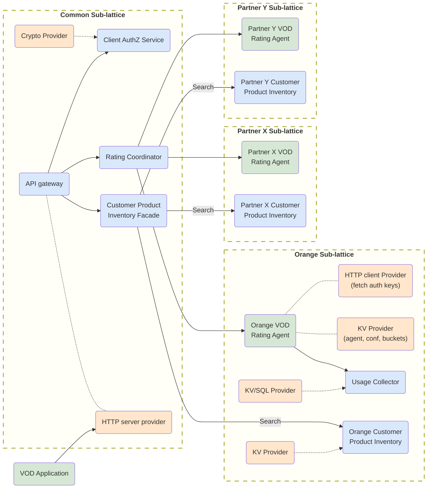

# Software Architecture

## Actors

```mermaid
flowchart LR

  vod(VOD Application)
  subgraph common [Common Sub-lattice]
    authz(Client AuthZ Service)
    coordinator(Rating Coordinator)
    crypto(Crypto Provider)
    facade("Customer Product <br> Inventory Facade")
    gateway(API gateway)
    httpd(HTTP server provider)
  end
  subgraph orange [Orange Sub-lattice]
    orange_agent_http("HTTP client Provider <br> (fetch auth keys)")
    orange_agent_kv("KV Provider <br> (agent, conf, buckets)")
    orange_agent("Orange VOD <br> Rating Agent")
    orange_collector_kv(KV/SQL Provider)
    orange_collector("Usage Collector")
    orange_inventory_kv(KV Provider)
    orange_inventory("Orange Customer <br> Product Inventory")
  end
  subgraph partner_x [Partner X Sub-lattice]
    partner_x_agent("Partner X VOD <br> Rating Agent")
    partner_x_inventory("Partner X Customer <br> Product Inventory")
  end
  subgraph partner_y [Partner Y Sub-lattice]
    partner_y_agent("Partner Y VOD <br> Rating Agent")
    partner_y_inventory("Partner Y Customer <br> Product Inventory")
  end

  coordinator --> orange_agent
  coordinator --> partner_x_agent
  coordinator --> partner_y_agent
  crypto -.-> authz
  facade -->|Search|orange_inventory
  facade -->|Search|partner_x_inventory
  facade -->|Search|partner_y_inventory
  gateway --> authz
  gateway --> coordinator
  gateway --> facade
  gateway <-.- httpd
  orange_agent --> orange_collector
  orange_agent <-.- orange_agent_http
  orange_agent <-.- orange_agent_kv
  orange_collector_kv -.-> orange_collector
  orange_inventory_kv -.-> orange_inventory
  vod --> httpd
  
  classDef domain fill:#fffff7,stroke-dasharray:10,stroke-width:2px,font-weight:bold
  class common,orange,partner_x,partner_y domain

  classDef offer fill:#d6e8d5
  class vod,orange_agent,partner_x_agent,partner_y_agent offer

  classDef provider fill:#ffe6cc
  class crypto,httpd,orange_agent_http,orange_agent_kv,orange_collector_kv,orange_inventory_kv provider

  classDef actor fill:#dae8fc
  class authz,gateway,facade,coordinator,orange_collector,orange_inventory,partner_x_inventory,partner_y_inventory actor
```

Legend||
-|-
ORANGE|Capability Providers
BLUE  |Non offer-dependent Actors
GREEN |Offer-dependent Actors  <ins>_There is as many actor types as offers_</ins>
