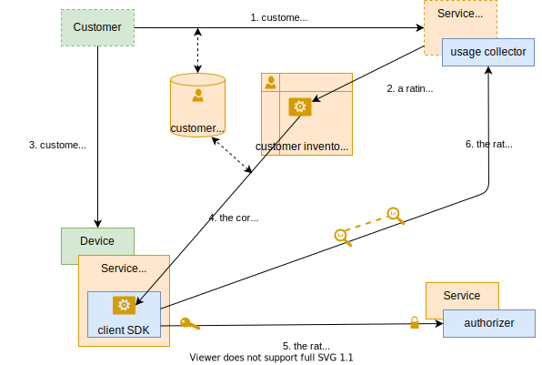
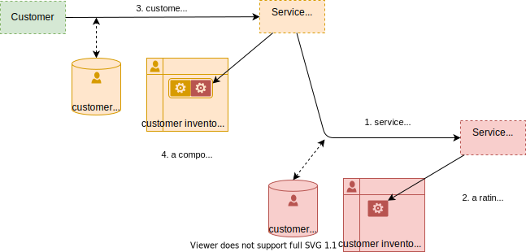
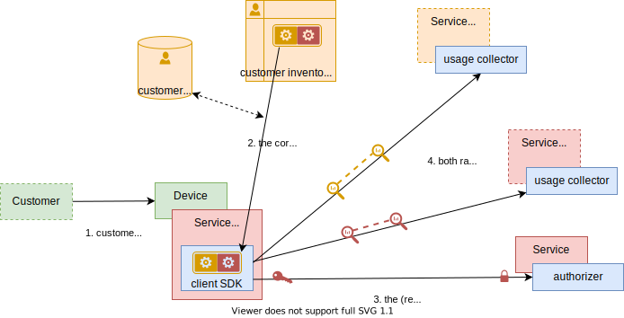
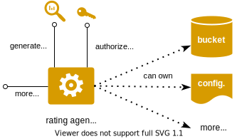

# Concepts

## third party management

- definitions
    - service vendor: customer-facing tier, manages the customer subscription, billing and payments
    - service provider: provides a technical service, also acts as a service vendor in B2B2X scenarios

### basic case: the service vendor is the service provider

- key ideas
    - usage rating is done client-side via a __rating agent__ deployed inside the service client app
    - a rating agent also acts as an authorization for consuming the service
    - a rating agents is the implementation of a commercial offer subscibed by the customer, it is managed like a contract

- communication diagram

    

### complex case: service vendor and service provider

- key ideas
    - the service vendor subscribes to a service provider (exactly like an end-user customer)
    - the users rating agent is a composite of service vendor and service provider rating agents
    - the service provider's rating agent is used as the authorization for consuming the service
    - end-user usage is uploaded to both service vendor and service provider

- communication diagram: service subscription

    

- communication diagram: service usage

    

> and what about provisionning?

## counting and rating

- a rating agent is a program specific a service / a commercial offer / a payment mode
- its implementation will depend on the use cases

    

### post-paid

rating agent will
- authorize the customer to consume the service
- generate __rated proofs of service usage__ that will be aggregated on the customer bill (maintained by the service vendor)

### prepaid / bucket management

rating agent will
- manage a __stateful service bucket__ and consume it according to customer usage
- report on the consuption of the service bucket
- authorize the customer to consume the service
- generates rated proofs of service usage, used for auditing / fraud detection

### µ-payments

rating agent will
- trigger payment request and expect payment proof before allowing the usage of the service
- authorize the customer to consume the service
- generates rated proofs of service usage, used for auditing / fraud detection

## agent mandatory traits

- authorizer trait: `authorize(identity) -> key`
- rater trait: `rate(usage) -> void`

### basic case

### composite case

- note that there is "shortcut" in `3. get vendor identity`. It does not really return an identity but a "vendor service subscription" authorization token. Check next paragraph

## identity management

The IAM have been simplified in the previous diagrams.

We distinguish
- Client identity (OIDC profile, OAuth token)
- Client service subscription authorization token (OAuth token): traded from the client identity, represents the fact that the client has subscribed to the service, regardless its right to access the service (for instance with an empty bucket on a prepaid service)

And the same for Service Vendors (which are Clients of Service Providers)

The authorizer trait signature is `authorize(service subscription authorization token) -> key`
