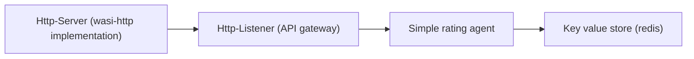

# Migration towards wasm v1 and wasi component model
## Objectives:
    1- explore the changes to the wasm echo-system after thr release of wasm 1.0 and adopting the component model and it tools
    2- suggest a strategy for migrating the existing code to the latest version of wasm
    3- attempt to make the migrated app compatible to and standard wasm standard runtime
## Motivation
    - With The announcement of the release of wasm 1.0 and the standardization of component model approach, the wasm main sponsers like wasmcloud iimmedietly started adopting wasm 1.0, which is a breaking change to the current state of the distributed-rating project, mandating a code migration
## Terms:
- [WASM](https://webassembly.org/):  a binary instruction format for a stack-based virtual machine
- [WIT](https://component-model.bytecodealliance.org/design/wit.html)  (Wasm Interface Type): an Interface definition language(IDL) used to define "WASM" Component Model interfaces and worlds
- [WASI](https://wasi.dev) (WebAssembly System Interface):  a group of standard API specifications for software compiled to the W3C WebAssembly (Wasm) standard. WASI is designed to provide a secure standard interface for applications that can be compiled to Wasm from any language, and that may run anywhere

## POC approach:
### Phase 1: Simple use case with wasm 1.0
- The initial goal was to try create a very basic use case based on the rating agent old scenarios 

- initial plan was not to target any wasm specific platform and use the standardized runtime (wasmtime) since it should be a reference to all platforms
- suggested steps for dev:
    1. migrate the interface definitions from old "smithy IDL" to the new standard "[wit IDL](https://component-model.bytecodealliance.org/design/wit.html)"
    2. create a simple http server (as an initial seed for an API gateway) as wasm component which implements wasi/http interface
    3. create a wasm component with basic rating-agent logic
    4. the rating agent should call the key-value store with an instnace of wasi/keyvalue interface
    5. call the rating agent from the http server
- Challenges and resolutions:
    1. Smithy IDL and WIT IDL have a few in common, and currently there are no tools to automate the migration. we had to write the interface manually  => This is a one-time issue and shall impose no concern in the future development as all old interfaces are already migrated
        - wasmcloud have some useful insights about this here https://github.com/wasmCloud/wasmCloud/issues/336 & https://wasmcloud.com/docs/0.82/concepts/interface-driven-development 
    4. Managing WIT dependencies is not mature, even using tooll such as wit-deps, as all dependencies must be included inside the project directory.
    3. WIT IDL , and wit-bindgen (the tool responsible for creating language specific interfaces) are still missing features that can be (and was in our case) criritcal, like defining serializable entities
        - The current workaround for this was to copy all interface definitions into a duplicate definitions with implement both mapping functionalities to oiriginal entities and also serialization behavior
        - Despite being currently the most realistic solution, it carries many drawbacks, as any changes in the wit files will demand a repetion for such task for the modified entities, which is not a best practice
    4. An attempt to use javascript as an alternative to rust for developing one of the components, however the tools available that support languages other than rust are somehow behind the maurity level of those for rust. We had to switch back to rust
    5. [**Blocker**] At the current time of writing this document, most **"wasi"** interfaces are in draft phase and have no reference implementation for wasmtime, including **0wasi/keyvalue**, which currently only implemented im-memeory store. We attempted to create an implementation on our own, without success. That is why we were forced to switch back to use wasmcloud runtime and tooling.
    6. developing for wasmcloud, has a significant divergence from developing for the standard wasm runtime, and sometimes demands using wasmcloud specific dependencies

### Phase 2: second level component communication
- The Distributed rating application is using a rating agent tree to calculate the required rate
- previoulsy such communication was achieved using wasmcloud "wasm-bus", for which we need to identify suitable alternative
- We investigated the usage of "RPC", and the findings were as follows:
    - we have three RPC threads in the wasm community
        1. [**wasi-grpc**](https://github.com/WebAssembly/wasi-grpc) : this is a system interface only, currently at draft phase, meaning that it has _no implementation yet_.
            - https://github.com/WebAssembly/WASI/issues/540
            - Nothing mentions if it is specific to Google's grpc prototcol or something more general
        2. [**wrpc**](https://github.com/bytecodealliance/wrpc): this is a project hosted by bytecodealliance, it is as defined in its [repository](https://github.com/bytecodealliance/wrpc) `Component-native transport-agnostic RPC protocol and framework based on WebAssembly Interface Types (WIT)`. It requires rust plus either docker or nats-server
        3. [**wasmcloud rpc**](https://wasmcloud.com/docs/hosts/lattice-protocols/rpc) : wasmCloud was the first reference implementation for wRPC. It uses it to make distributed communication between components to feel exactly like composing components

    > Conclusion: wasmcloud already uses rpc under the hood when doing component communications
    
    - Wasmcloud provides interfaces for customizing RPC calls, through wasmcloud configuration files