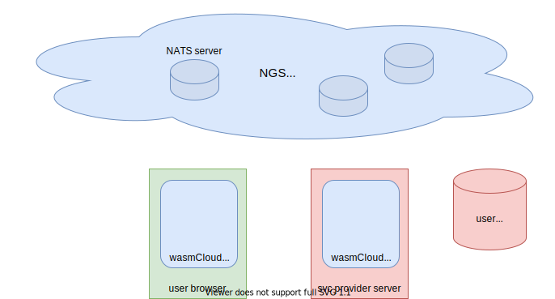

# Architecture

## components

- browser runtime
    - javascript wasmCloud runtime deployed as javascript SDK

- user ident/authent
    - OIDC / OAuth
    - expose service to recover browser runtime host-keys

- ngs
    - NATS network

