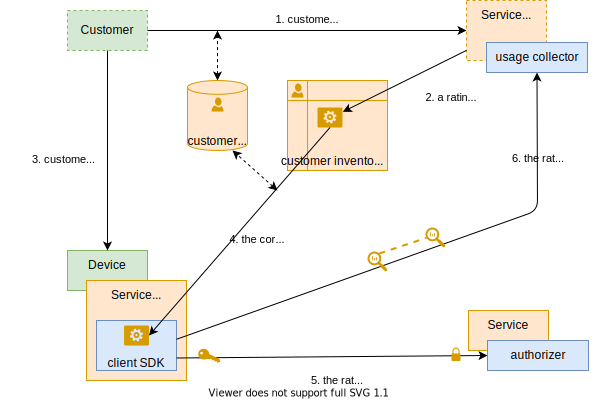
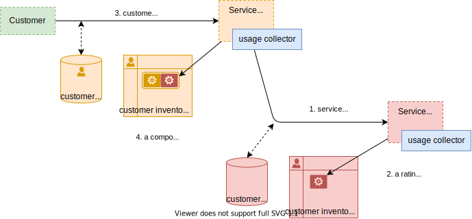
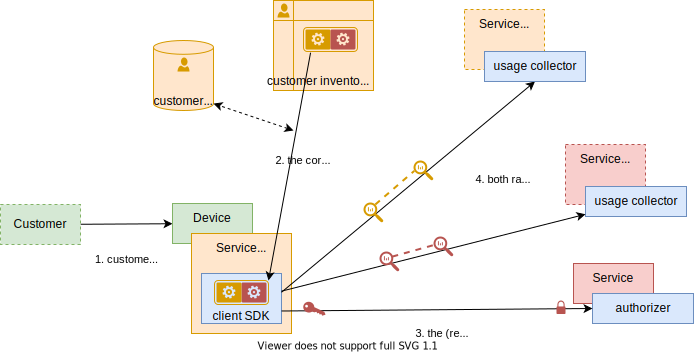

# Solution 1

proposed solution (WIP)

## third party management

### basic case: the service vendor is the service provider

- key ideas
    - usage rating is done client-side via a __rating agent__ deployed inside the service client app
    - a rating agent also acts as an authorization for consuming the service
    - a rating agents is the implementation of a commercial offer subscibed by the client, it is managed like a contract

- communication diagram

### complex case: service vendor and service provider

- key ideas
    - the service vendor subscribes to a service provider (exactly like an end-user customer)
    - the users rating agent is a composite of service vendor and service provider rating agents
    - the service provider's rating agent is used as the authorization for consuming the service
    - end-user usage is uploaded to both service vendor and service provider

#### service subscription

#### service usage

> and what about provisionning?

## counting and rating

### prepaid / bucket management

### post-paid

### µ-payments