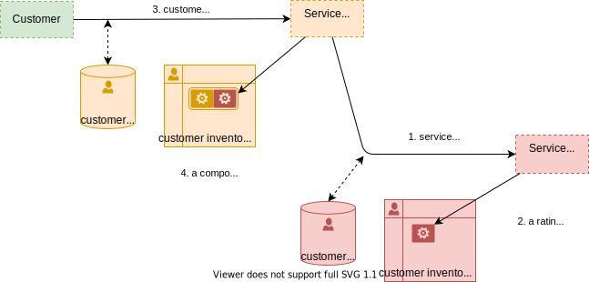

# Solution 1

proposed solution (WIP)

## third party management

### basic case: the service vendor is the service provider

### complex case: service vendor and service provider

- key ideas
    - the users rating agent is a composite of service vendor and service provider rating agents
    - end-user usage is uploaded to both service vendor and service provider

#### service subscription

#### service usage

> and what about provisionning?

## counting and rating

### prepaid / bucket management

### post-paid

### µ-payments