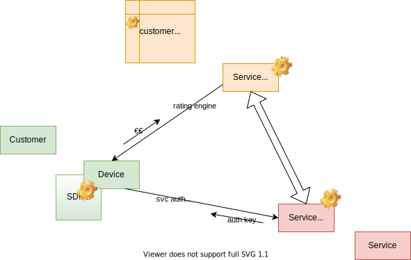

# Model

## Domain exploration

- 3 main actors
    - Service Consumer
    - Service Vendor
    - Service Provider

- concepts
    - rating engine
    - proofs
        - subscription
        - usage
        - identity

- to be discussed
    - entities modeling
        - are Service Vendors also service providers?
        - are service Vendors also service consumers?
        - implementation note: instead of inheritance we can use traits
    - where shoud the usage proof go ?
        - service vendor / provider / both
        - avoid proxies
    