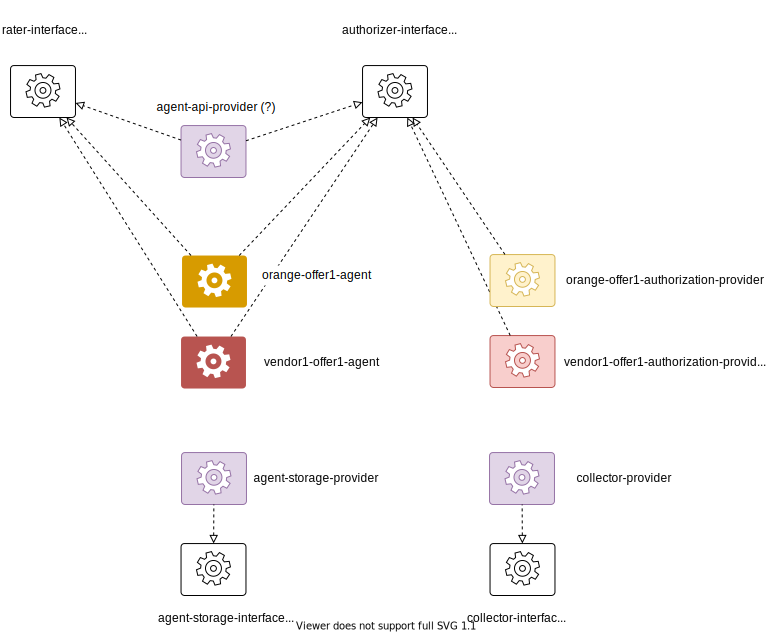

# Prototype Architecture

## actor model



## git repos

```
├── generic
│   ├── agent-api-provider
│   ├── agent-storage-provider
│   └── collector-provider
├── interface
│   ├── agent-storage-interface
│   ├── authorizer-interface
│   ├── collector-interface
│   └── rater-interface
├── specific-orange
│   ├── orange-offer1-agent
│   └── orange-offer1-authorization-provider
└── specific-vendor1
    ├── vendor1-offer1-agent
    └── vendor1-offer1-authorization-provider
```